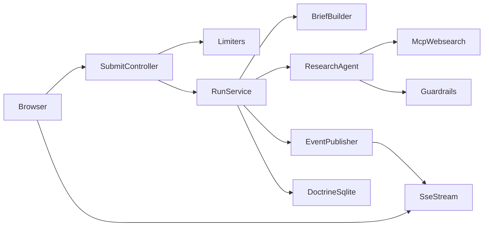

# Web Research Agent Plan

## Scope

- Build the first iteration in `[/home/ineersa/projects/re-search](/home/ineersa/projects/re-search)` only.
- Use `IP + session` as the limiter/budget identity key.
- Keep prompts out of YAML: move prompt/brief logic into PHP classes under `src/Research/`.
- Recommendation: keep the query formatter deterministic in v1, but let `ResearchBriefBuilder` actively reformat the raw user request into a structured research brief. If needed later, add a lightweight `QueryRefiner` or `QueryRefinerAgent` for semantic reframing before the main research run.
- Use Mercure first so the feature is built around private topics, auth, and real publish/subscribe flow from day one. Keep `EventPublisherInterface` so an SSE fallback can still be added later without touching orchestration code.
- Chosen implementation strategy: `Option B`. Build a small custom orchestration loop on top of Symfony AI platform/agent/tool primitives from the start, instead of relying on the fully managed bundle loop.

## Existing Starting Points

- UI shell to keep and wire to real backend: `[/home/ineersa/projects/re-search/templates/home/index.html.twig](/home/ineersa/projects/re-search/templates/home/index.html.twig)`
- Current frontend stub to replace with live stream consumption: `[/home/ineersa/projects/re-search/assets/controllers/research_ui_controller.js](/home/ineersa/projects/re-search/assets/controllers/research_ui_controller.js)`
- Current entry controller: `[/home/ineersa/projects/re-search/src/Controller/HomeController.php](/home/ineersa/projects/re-search/src/Controller/HomeController.php)`
- AI config placeholder: `[/home/ineersa/projects/re-search/config/packages/ai.yaml](/home/ineersa/projects/re-search/config/packages/ai.yaml)`
- SQLite/Doctrine base already present: `[/home/ineersa/projects/re-search/config/packages/doctrine.yaml](/home/ineersa/projects/re-search/config/packages/doctrine.yaml)`
- Llama platform already stream-capable: `[/home/ineersa/projects/re-search/src/Platform/LlamaCpp/PlatformFactory.php](/home/ineersa/projects/re-search/src/Platform/LlamaCpp/PlatformFactory.php)`
- Reference streaming/chat patterns to borrow ideas from: `[/home/ineersa/projects/ai/demo/src/Stream/TwigComponent.php](/home/ineersa/projects/ai/demo/src/Stream/TwigComponent.php)`, `[/home/ineersa/projects/ai/demo/src/Wikipedia/Chat.php](/home/ineersa/projects/ai/demo/src/Wikipedia/Chat.php)`, `[/home/ineersa/.cursor/agents/web-research.md](/home/ineersa/.cursor/agents/web-research.md)`

## Architecture



## Implementation Notes

- Keep YAML limited to platform/service wiring. Put research instructions in PHP classes such as `ResearchBriefBuilder`, `ResearchPromptFactory`, and `ResearchRunService`.
- Model two output channels from the backend:
    - `activity` events for tool calls, reasoning summaries, budget counters, and warnings
    - `answer` events for incremental/final markdown
- Store one run plus many steps/messages in SQLite so history can reload both final answer and trace.
- Guardrails should be explicit runtime logic, not only prompt text:
    - primary and only research budget: `75_000` total tokens per run
    - estimate tokens with `characters / 3.75` when provider token usage is unavailable
    - global step cap, e.g. `75`
    - repeated normalized tool-call signature cap: allow the same call twice, stop on the third identical call
    - optional wall-clock timeout, e.g. `2-3 minutes`
- For nested/deep research, prefer budget caps plus duplicate-call detection over "deep recursion" tracking alone. In v1, avoid recursive subagent chains entirely: one orchestrated research run, one web-research subagent.
- Render final markdown in both raw and rendered modes; add `highlight.js` only after live markdown rendering is stable.
- Symfony AI can persist message history through the Chat component and pluggable message stores, but this feature still needs custom Doctrine persistence for `ResearchRun` and `ResearchStep` because we need tool traces, budget counters, Mercure replay metadata, and run-level audit fields.

## Symfony AI Technical Design

### Chosen Orchestration Strategy

- We are explicitly choosing `Option B`.
- That means:
    - do **not** treat `ai.agent.web_research` as the main runtime loop
    - do use Symfony AI primitives for model calls, tools, messages, metadata, and result handling
    - do build our own `ResearchOrchestrator` that controls each research turn
- Reason:
    - we need mid-flight budget injection
    - we need to switch to answer-only mode before budget exhaustion
    - we need duplicate-call loop control at the orchestration layer
    - we want predictable Mercure event emission around every turn

### Exact ResearchOrchestrator Algorithm

`ResearchOrchestrator` should own a deterministic loop like this:

1. Load `ResearchRun` and initialize working state.
2. Build the initial system brief from `ResearchBriefBuilder`.
3. Create initial `MessageBag` with:

- system brief
- original user message

1. Initialize orchestration state:

- `turn = 0`
- `answerOnly = false`
- `tokenBudgetUsed = 0`
- `duplicateCallMap = []`
- `lastBudgetNoticeThreshold = 0`

1. Start loop while:

- run is not completed
- timeout not reached
- `turn < 75`

1. Before each model turn:

- compute estimated remaining token budget
- if below answer threshold, set `answerOnly = true`
- if crossed next `5_000` threshold, append a budget update system message
- if `answerOnly = true`, append a system message explicitly forbidding further tool use and asking for the best final answer from gathered evidence

1. Execute one model turn via Symfony AI platform/agent primitives.
2. Inspect result:

- if plain final answer with no tool intent, persist answer chunk/final answer and finish
- if tool calls requested and `answerOnly = false`, continue to tool execution
- if tool calls requested and `answerOnly = true`, ignore tool intent and run one more forced-answer turn

1. For each requested tool call:

- normalize signature
- if signature seen twice already, mark loop and stop research
- run `ResearchBudgetEnforcer::beforeToolCall()`
- execute tool
- run `ResearchBudgetEnforcer::afterToolCall()`
- persist `ResearchStep`
- publish Mercure `activity` event
- append tool result back into working messages

1. After each model/tool cycle:

- update token usage from provider metadata or estimator
- publish Mercure `budget` event
- persist budget snapshot on run/step

1. If hard budget exceeded:

- append forced final-answer instruction
- allow one final no-tools answer turn if possible
- otherwise stop with budget-exhausted state

1. Persist final state:

- final markdown answer
- completion status
- total token estimate/usage
- loop/budget/timeout reason if applicable

1. Publish Mercure `complete` event.

### Turn DTOs

The orchestrator should use explicit DTOs instead of raw arrays so each step is testable.

Suggested DTO set:

- `src/Research/Orchestration/Dto/ResearchTurnInput.php`
- `src/Research/Orchestration/Dto/ResearchTurnResult.php`
- `src/Research/Orchestration/Dto/ToolCallDecision.php`
- `src/Research/Orchestration/Dto/BudgetState.php`

`ResearchTurnInput`:

```php
final readonly class ResearchTurnInput
{
    public function __construct(
        public string $runId,
        public int $turnNumber,
        public array $messages,
        public BudgetState $budget,
        public bool $answerOnly,
        public ?string $forcedInstruction,
    ) {
    }
}
```

`ResearchTurnResult`:

```php
final readonly class ResearchTurnResult
{
    /**
     * @param list<ToolCallDecision> $toolCalls
     */
    public function __construct(
        public string $assistantText,
        public array $toolCalls,
        public bool $isFinal,
        public ?int $promptTokens,
        public ?int $completionTokens,
        public ?int $totalTokens,
        public array $rawMetadata,
    ) {
    }
}
```

`ToolCallDecision`:

```php
final readonly class ToolCallDecision
{
    public function __construct(
        public string $name,
        public array $arguments,
        public string $normalizedSignature,
    ) {
    }
}
```

`BudgetState`:

```php
final readonly class BudgetState
{
    public function __construct(
        public int $hardCapTokens,
        public int $usedTokens,
        public int $remainingTokens,
        public int $nextNoticeAt,
        public bool $answerOnly,
    ) {
    }
}
```

### Exact File Targets

#### `config/packages/ai.yaml`

Purpose:

- keep only platform-level wiring and optional thin model defaults
- do not store the real research prompt here

Expected contents:

- `ai.platform.llama` or equivalent existing platform reference
- optional thin `agent.web_research_runtime` definition if helpful for service resolution
- no large inline research instructions

Expected role:

- dependency wiring only

#### `config/services.yaml`

Add service definitions for:

- `App\Research\ResearchRunService`
- `App\Research\Orchestration\ResearchOrchestrator`
- `App\Research\ResearchBriefBuilder`
- `App\Research\Query\QueryRefiner`
- `App\Research\ResearchAgentFactory`
- `App\Research\Tool\WebSearchTool`
- `App\Research\Toolbox\ResearchToolEventSubscriber`
- `App\Research\Guardrail\ResearchBudget`
- `App\Research\Guardrail\ResearchBudgetEnforcer`
- `App\Research\Token\TokenUsageTracker`
- `App\Research\Event\EventPublisherInterface`
- `App\Research\Event\MercureEventPublisher`
- `App\Research\Mercure\ResearchTopicFactory`

Important wiring notes:

- alias `EventPublisherInterface` to `MercureEventPublisher`
- inject Mercure `HubInterface` into the publisher
- inject the platform or runtime factory into `ResearchAgentFactory`
- autoconfigure the event subscriber

#### `config/packages/mercure.yaml`

Add explicit Mercure hub configuration for:

- default hub
- publish URL
- public URL
- JWT secret/env wiring
- private topic support

Expected role:

- make run-scoped private topics first-class

Expected runtime topic format:

- `https://re-search.local/research/runs/{uuid}`

#### `src/Entity/ResearchRun.php`

Suggested fields:

- `id` UUID
- `query` text
- `queryHash` string
- `status` string or enum
- `finalAnswerMarkdown` text nullable
- `tokenBudgetHardCap` int
- `tokenBudgetUsed` int
- `tokenBudgetEstimated` bool
- `loopDetected` bool
- `answerOnlyTriggered` bool
- `failureReason` text nullable
- `mercureTopic` string
- `clientKey` string or derived fingerprint field
- `createdAt` datetime immutable
- `updatedAt` datetime immutable
- `completedAt` datetime immutable nullable

Suggested status values:

- `queued`
- `running`
- `answer_only`
- `completed`
- `failed`
- `budget_exhausted`
- `loop_stopped`
- `timed_out`

Rendering note:

- store markdown only
- derive rendered HTML at response/render time instead of persisting it

#### `src/Entity/ResearchStep.php`

Suggested fields:

- `id` UUID
- `run` many-to-one to `ResearchRun`
- `sequence` int
- `type` string
- `turnNumber` int
- `toolName` string nullable
- `toolArgumentsJson` text nullable
- `toolSignature` string nullable
- `summary` text
- `payloadJson` text nullable
- `promptTokens` int nullable
- `completionTokens` int nullable
- `totalTokens` int nullable
- `estimatedTokens` bool
- `createdAt` datetime immutable

Suggested step types:

- `run_started`
- `turn_started`
- `budget_notice`
- `tool_arguments_resolved`
- `tool_executed`
- `tool_succeeded`
- `tool_failed`
- `loop_detected`
- `answer_only_enabled`
- `assistant_partial`
- `assistant_final`
- `run_completed`
- `run_failed`

### Exact Responsibilities By File

- `ResearchRunService`
  Application entry point for a run. Loads entities, delegates runtime behavior to the orchestrator, and commits final state.
- `ResearchOrchestrator`
  Owns the loop, budget reminders, answer-only mode, and per-turn control.
- `ResearchAgentFactory`
  Creates the model-facing callable/runtime object used on each turn.
- `WebSearchTool`
  Executes only MCP-backed web search actions and returns normalized tool payloads.
- `ResearchToolEventSubscriber`
  Converts Symfony AI tool lifecycle events into persisted steps plus Mercure events.
- `MercureEventPublisher`
  Publishes `activity`, `answer`, `budget`, and `complete` events.
- `TokenUsageTracker`
  Computes cumulative token usage from metadata or estimator.
- `ResearchRun`
  Stores run-level state and final outputs.
- `ResearchStep`
  Stores per-turn and per-tool timeline for replay and auditing.

### What Stays In YAML

- `config/packages/ai.yaml`
  Define only the platform and the top-level research agent service wiring.
- `config/services.yaml`
  Register the PHP services that own prompt building, tool wrapping, guardrails, event publishing, and persistence.

Example target shape:

```yaml
ai:
    platform:
        llama:
            # existing llama/generic platform wiring

    agent:
        web_research:
            platform: "ai.platform.llama"
            model: "flash"
            prompt:
                text: "placeholder, replaced by PHP-built brief before execution"
                include_tools: true
            tools:
                - service: 'App\Research\Tool\WebSearchTool'
                  name: "websearch_search"
                  description: "Search the web through the MCP web search service"
                  method: "search"
                - service: 'App\Research\Tool\WebSearchTool'
                  name: "websearch_open"
                  description: "Open a specific search result through the MCP web search service"
                  method: "open"
                - service: 'App\Research\Tool\WebSearchTool'
                  name: "websearch_find"
                  description: "Find text within an opened page through the MCP web search service"
                  method: "find"
```

- The YAML agent remains thin on purpose.
- The real research instructions are assembled in PHP and added as the system message for each run.
- With `Option B`, YAML is mostly dependency wiring, not the main execution engine.

### PHP File Layout

- `src/Research/Controller/ResearchController.php`
  Accepts submit/history requests and returns run metadata.
- `src/Research/Controller/ResearchMercureController.php`
  Returns Mercure authorization for a specific run topic or sets the run-scoped auth cookie.
- `src/Research/ResearchRunService.php`
  Main application service. Creates a run, builds the brief, executes the agent, persists steps, and publishes stream events.
- `src/Research/Orchestration/ResearchOrchestrator.php`
  Custom turn-by-turn runtime loop. Decides when to call the model, when to allow tools, when to inject budget reminders, and when to force final answer mode.
- `src/Research/ResearchBriefBuilder.php`
  Deterministically reformats the user query into the research brief: current date, output contract, citation rules, table preference, goals, subquestions, and stop conditions.
- `src/Research/Query/QueryRefiner.php`
  Optional semantic query reframing layer. It can stay rule-based at first and become a small dedicated agent later if needed.
- `src/Research/ResearchAgentFactory.php`
  Factory for the model-facing agent/runtime pieces used by the orchestrator, with per-turn prompt injection and custom processor wiring.
- `src/Research/Tool/WebSearchTool.php`
  Thin Symfony AI tool adapter exposing `search()`, `open()`, and `find()` methods. Internally calls the MCP web search server over the configured streamable HTTP client.
- `src/Research/Toolbox/ResearchToolEventSubscriber.php`
  Listens to Symfony AI tool lifecycle events and converts them into persisted `ResearchStep` records plus streamed `activity` events.
- `src/Research/Guardrail/ResearchBudget.php`
  Tracks per-run token usage, total steps, duplicate signatures, and timeout state.
- `src/Research/Guardrail/ResearchBudgetEnforcer.php`
  Called before/after each tool invocation to reject over-budget or looping behavior.
- `src/Research/Token/TokenUsageTracker.php`
  Reads Symfony AI `token_usage` metadata when available and otherwise falls back to approximate token estimation with `characters / 3.75`.
- `src/Research/Event/EventPublisherInterface.php`
  App-level abstraction for pushing `activity`/`answer` events.
- `src/Research/Event/MercureEventPublisher.php`
  First transport implementation publishing `activity`, `answer`, `budget`, and `complete` events to a private run topic.
- `src/Research/Mercure/ResearchTopicFactory.php`
  Builds one Mercure topic per run.
- `src/Research/Persistence/ResearchRunRepository.php`
  Query helpers for sidebar history and run replay.
- `src/Entity/ResearchRun.php`
  One record per user request.
- `src/Entity/ResearchStep.php`
  One record per tool call, reasoning summary, warning, or lifecycle step.

### How Symfony AI Agent/Toolbox Fits

- We should use Symfony AI's **platform/message/result/tooling primitives** and the **toolbox as the MCP adapter layer**.
- The orchestrator responsibility moves into our app code.
- The top-level run flow would be:
    1. `ResearchRunService` receives raw user query.
    2. `ResearchBriefBuilder` creates the structured system brief.
    3. The app creates a `MessageBag` with:
    - system message from the brief builder
    - user message with the original query
    1. `ResearchOrchestrator` runs a controlled loop:
    - call model
    - inspect result/tool intent
    - inject budget updates
    - allow or stop tools
    - request final answer when needed
    1. Symfony AI tools execute through the toolbox layer.
    2. Tool lifecycle events are observed and mirrored into:
    - Mercure `activity` events
    - `ResearchStep` persistence rows
    1. Final markdown is stored on `ResearchRun` and emitted as the terminal `answer` event.

### How The Brief Builder Reformats The Query

- Yes, `ResearchBriefBuilder` can reformat the raw user query.
- It does this deterministically by turning the input into a stable research brief, for example:
    - preserve the original user wording
    - derive a research goal
    - split out explicit verification targets
    - inject current date
    - inject citation and output rules
    - inject budget and stopping rules
- This gives the main research agent a much better system message without keeping a giant prompt in YAML.

Example shaped brief:

```text
Today: 2026-03-17

Research goal:
- Determine ...

Original user query:
- "raw query here"

Required behavior:
- verify claims from sources
- cite every non-trivial factual claim
- return markdown

Budget:
- hard token cap: 75000
- soft reminder every 5000 tokens
```

- If you want semantic rewriting beyond templating, that is where `QueryRefiner` or a future `QueryRefinerAgent` fits.

### How The Proper Prompt Gets Injected

- We do not depend on the YAML prompt for the real research instructions.
- `ResearchRunService` should build the `MessageBag` like this:
    - `Message::forSystem($researchBrief)`
    - `Message::ofUser($rawUserQuery)`
- The YAML prompt stays minimal; the real per-run research prompt comes from PHP.
- In `Option B`, this happens not only at the start of the run, but also between turns when the orchestrator appends budget updates or switches the model into answer-only mode.
- That lets us inject:
    - current date
    - source/citation rules
    - output format
    - remaining budget or stop conditions
    - future per-user or per-run policy changes

### Why Use Symfony AI Tools Instead Of Calling MCP Directly From The Run Service

- Tool metadata is exposed to the model automatically with `include_tools: true`.
- Tool argument resolution and serialization are handled consistently by Symfony AI.
- Tool lifecycle events give us a natural hook for trace streaming and persistence.
- Guardrails can be enforced around each tool call instead of only around the whole run.
- The same tool adapter can later be reused by another agent without rewriting the MCP client.

### MCP Web Search Tool Adapter

- `WebSearchTool` should not contain prompt logic.
- It should only:
    - call MCP `search`
    - call MCP `open`
    - call MCP `find`
    - normalize responses into compact arrays/DTOs safe for the model
    - attach enough metadata for persistence and trace rendering
- Budget enforcement should happen before and after delegating to MCP.
- Duplicate detection should normalize a tool signature like:
    - `toolName + normalized args + normalized url/query`

Example responsibilities:

```php
final class WebSearchTool
{
    public function __construct(
        private readonly McpWebSearchClient $client,
        private readonly ResearchBudgetEnforcer $budgetEnforcer,
    ) {
    }

    public function search(string $query): array
    {
        $this->budgetEnforcer->beforeToolCall('websearch_search', ['query' => $query]);

        $result = $this->client->search($query);

        $this->budgetEnforcer->afterToolCall('websearch_search', ['query' => $query], $result);

        return $result;
    }
}
```

### Tool Event Streaming

- Symfony AI tool lifecycle listeners are the cleanest place to feed the UI trace.
- The subscriber should listen for:
    - tool arguments resolved
    - tool executed
    - tool succeeded
    - tool failed
- On each event it should:
    - append a `ResearchStep`
    - publish an `activity` Mercure payload
    - update run status if needed

Payload shape to stream to the frontend:

```json
{
    "type": "activity",
    "stepType": "tool_succeeded",
    "tool": "websearch_open",
    "summary": "Opened official Symfony docs page",
    "meta": {
        "url": "https://symfony.com/doc/current/rate_limiter.html"
    }
}
```

### Reasoning Visibility

- Do not rely on full hidden chain-of-thought exposure.
- Instead, stream **app-generated reasoning summaries** such as:
    - `Planning search strategy`
    - `Comparing official docs with secondary source`
    - `Stopping because duplicate search detected`
- These summaries should be emitted by our orchestration layer and guardrail layer, not by asking the model to reveal raw internal reasoning.

### Symfony AI Persistence

- Yes, Symfony AI has persistence ability for chat history.
- The built-in pattern is `Chat` + `AgentInterface` + `MessageStoreInterface`.
- Documented message store options include in-memory, cache, Doctrine DBAL, session, Redis, and others.
- That is useful for storing conversation history, but it is not enough by itself for this feature because we also need:
    - tool activity timeline
    - run status
    - Mercure topic/replay metadata
    - token budget snapshots
    - loop/budget failure reasons
- So the plan should use:
    - Symfony AI message store if we want ongoing chat continuity
    - custom `ResearchRun` and `ResearchStep` entities for research auditing and replay

### Token Budgeting

- Token budget is the only research budget in this design.
- Symfony AI result metadata can carry:
    - prompt tokens
    - completion tokens
    - total tokens
    - remaining tokens
    - cached tokens
    - thinking tokens
- Important caveat:
    - this depends on the platform bridge/provider response
    - when token usage is missing from the current llama/generic path, we fall back to approximate counting with `characters / 3.75`
- Recommended policy:
    - hard stop at `75_000` cumulative total tokens
    - soft notices every `5_000` tokens
    - duplicate-call loop detection remains independent of token budget

### How Token Budget Notices Reach The Agent

- A reminder like `<X tokens left>` is feasible, but it should be injected by our orchestration layer, not hard-coded in YAML.
- Required design:
    - after each model/tool cycle, the orchestrator checks whether a `5_000` token threshold was crossed
    - if yes, the next model turn gets a short budget reminder appended to the working system context
    - when remaining budget is too low for another research step, the orchestrator switches the next turn into answer-only mode and explicitly forbids more tool use

Example reminder:

```text
Budget update:
- total tokens used so far: 40000
- estimated tokens left before hard cap: 35000
- continue only if the next search materially improves the answer
```

- Mid-flight budget injection is not optional for the preferred behavior.
- `Option B` solves this directly by making the orchestrator responsible for turn construction.
- Server-side-only enforcement is still required as a hard stop, but it is not sufficient as the main behavior because the model must know when to stop researching and answer.

### Duplicate Call Rule

- Remove tool-count budgets completely.
- Keep only token budget plus duplicate-call loop protection.
- Normalize each tool call into a signature such as:
    - `toolName + normalized args + normalized target`
- Allow the same normalized call twice.
- Treat the third identical call in the same run as a loop and stop further tool use.

### Prompt/Brief Injection Strategy

- Preferred v1 approach:
    - keep the agent registered in YAML
    - build the run-specific brief in PHP
    - prepend it as the system message in the `MessageBag`
- This avoids hard-coding prompts in YAML while still benefiting from the AI Bundle's agent and tool registration.
- Only introduce a custom `ResearchAgentFactory` if we hit limits with the container-provided `ai.agent.web_research` service.

### Concrete Run Sequence

1. `POST /research/runs`
   Validate input, apply `IP + session` throttles, create `ResearchRun`, return `runId`.
2. `GET /research/runs/{id}/mercure-auth`
   Return or set authorization for the run's private Mercure topic.
3. Frontend subscribes to the run topic through Mercure.
4. A controller/service starts `ResearchRunService::execute($runId)`.
5. `ResearchRunService` builds the initial system brief and hands control to `ResearchOrchestrator`.
6. `ResearchOrchestrator` performs a model turn using Symfony AI primitives.
7. If a tool call is needed, `WebSearchTool` executes through the toolbox layer.
8. Tool event subscriber persists and publishes tool activity rows.
9. After each turn, the orchestrator updates budget state and injects the next system guidance.
10. If remaining budget is too low, the orchestrator forces answer-only mode with no further tool use.
11. Guardrails stop loops or token-budget overruns by throwing domain exceptions caught by `ResearchRunService`.
12. Final markdown is saved to `ResearchRun.finalAnswerMarkdown`.
13. Mercure publishes final `answer`, `budget`, and `complete` events.
14. Sidebar history later loads from Doctrine, not session memory.

## Iterative Delivery

1. Add backend domain skeleton in `src/Research/`.
   Create isolated services/interfaces for run orchestration, brief building, event publishing, limiter/budget enforcement, and history loading without wiring the real model loop yet.
2. Add persistence model and migrations.
   Create entities such as `ResearchRun`, `ResearchStep`, and optionally `ResearchMessage`/`ResearchSource`, then add Doctrine migrations for SQLite-backed history and audit data.
3. Add request throttling and research budgets.
   Configure Symfony RateLimiter for `IP + session`, enforce `1 request / 10 minutes` and `5 requests / day`, and add token-budget plus duplicate-call detection in a dedicated guardrail service.
4. Add the real research orchestration service.
   Implement `ResearchBriefBuilder`, `ResearchRunService`, and `ResearchOrchestrator` so the app controls the turn loop directly, injects budget updates between turns, applies the web-research rules from `[/home/ineersa/.cursor/agents/web-research.md](/home/ineersa/.cursor/agents/web-research.md)`, and normalizes tool/result events into app-level DTOs.
5. Add Mercure-backed streaming endpoints.
   Introduce a submit/start endpoint plus Mercure topic authorization flow; publish `activity`, `answer`, `budget`, and `complete` events through a transport-agnostic publisher interface.
6. Replace the stub Stimulus flow with live streaming.
   Update `research_ui_controller.js` to submit real runs, consume Mercure events, append tool activity to the trace UI, append markdown answer chunks to the answer container, and support cancel/reconnect behavior.
7. Add markdown rendering modes.
   Render final markdown safely in the answer pane, provide a raw/rendered toggle, and then add `highlight.js` for fenced code blocks.
8. Add history loading from SQLite.
   Replace fake sidebar history with persisted runs, support loading a past run into the existing answer/trace panes, and show run status, timestamps, and limiter/budget outcomes.
9. Add observability and failure handling.
   Persist limiter rejections, budget exhaustion, token usage snapshots, agent/tool errors, and incomplete runs; expose friendly UI states for throttled, timed out, and aborted research.
10. Add SSE fallback only if Mercure becomes a blocker.
    Keep the transport abstraction so a lightweight `SseEventPublisher` can be introduced later without changing the orchestration layer.
