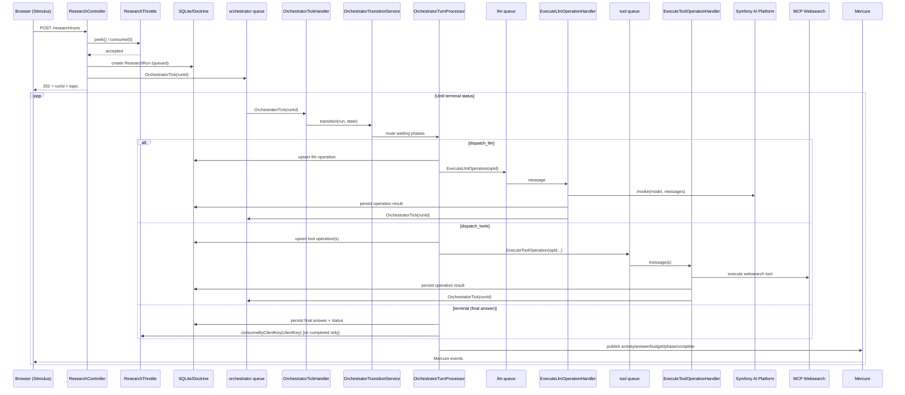

# Architecture

This document describes the current **re-search** architecture.

The implementation is event-driven and DB-backed: the orchestrator advances a run in short ticks, while dedicated workers perform LLM and tool IO. The orchestration logic is split into focused services (transition routing, turn processing, operation/payload mapping, state management, and step recording) to keep each handler small and deterministic.

## Research Workflow Overview

The web research flow uses Symfony Messenger queues plus Mercure event streaming.

## Queue Topology

- `orchestrator`: handles `OrchestratorTick` state transitions.
- `llm`: handles `ExecuteLlmOperation` model calls.
- `tool`: handles `ExecuteToolOperation` tool executions.

All handlers are intentionally short and finite. Long work is split across multiple messages.

## AI platform integration

Model calls go through Symfony AI’s `PlatformInterface`, resolved by **`App\Research\Platform\ResearchPlatformFactory`** from the **`AI_PLATFORM`** environment variable (`llama` \| `generic` \| `zai`). The active model id comes from **`RESEARCH_MODEL`**.

| Platform | Service | Typical env vars | Notes |
| :--- | :--- | :--- | :--- |
| **llama** | `App\Platform\LlamaCpp\PlatformFactory` | `LLAMACPP_BASE_URL`, `LLAMACPP_API_KEY` | Local [llama.cpp](https://github.com/ggerganov/llama.cpp) server; uses the generic completions stack with a custom **`Contract`** / **`ToolCallNormalizer`** for tool-argument JSON shape. |
| **generic** | `App\Platform\Generic\PlatformFactory` | `GENERIC_BASE_URL` | OpenAI-compatible HTTP API (`/v1/chat/completions`). |
| **zai** | `App\Platform\Zai\PlatformFactory` | `ZAI_BASE_URL` (default `https://api.z.ai/api/paas/v4/`), `ZAI_API_KEY` | Z.AI cloud; uses the same generic completions stack with Z.AI’s **`/chat/completions`** path, **`EventSourceHttpClient`** for streaming, and **`App\Platform\Zai\ModelCatalog`** for supported GLM models and capability flags. |

All three platforms use the shared **`App\Platform\Generic\Completions\ModelClient`** and **`App\Platform\Generic\Completions\ResultConverter`**. That converter normalizes streaming deltas (including tool arguments and optional “thinking” / reasoning fields) so orchestration and tracing stay consistent across providers.

**Z.AI-specific behavior**: With GLM models and Z.AI’s interleaved **`tool_stream`** responses, reasoning, visible content, and tool-call fragments can arrive in one stream. How that is assembled and how reasoning is preserved across turns is documented in [docs/interleaved_reasoning_and_tool_calls.md](docs/interleaved_reasoning_and_tool_calls.md). Model-level options (for example **`preserve_reasoning_history`**) live in **`src/Platform/Zai/ModelCatalog.php`**; a capability summary is in **`src/Platform/Zai/CAPABILITIES.md`**.

Configuration references: **`config/services.yaml`** (tagged `ai.platform` services and `ResearchPlatformFactory` locator), **`config/packages/ai.yaml`** (platform list / bundle notes).

## Request Lifecycle

1. **Submission**: frontend sends query to `ResearchController::submit()`.
2. **Rate limit preflight**: for **anonymous** requests, `ResearchThrottle::peek()` checks client IP quota via Symfony RateLimiter (`consume(0)`, no token consumption). **Authenticated** users skip this gate (no per-day submit cap via this limiter).
3. **Run creation**: `ResearchRun` is stored with `status=queued`, `phase=queued`, and a Mercure topic.
4. **Initial tick dispatch**: controller dispatches `OrchestratorTick(runId)` directly to the `orchestrator` transport.
5. **Orchestrator transition**: `OrchestratorTickHandler` acquires a per-run lock and delegates to `OrchestratorTransitionService`.
6. **LLM/tools fan-out**: transition logic creates `ResearchOperation` rows and dispatches either LLM or tool operation messages.
7. **Worker completion feedback**: LLM/tool handlers persist operation results and dispatch a new `OrchestratorTick`.
8. **Run completion**: when terminal, final answer and status are persisted and a `complete` event is published.
9. **Token consumption on success**: for anonymous clients, one limiter token is consumed when a run reaches `completed` (not on failed/aborted/throttled runs). Keys prefixed with `user:` (authenticated) do not consume IP limiter tokens.

**Client key**: runs are scoped to a stable key from `ResearchController::buildClientKey()`: authenticated users use `user:` + a hash of the user identifier; anonymous users use `client IP` + `session id`. This key is stored on `ResearchRun` and used for list/show/stop authorization.

## Orchestrator State Machine

Run progression is tracked with `ResearchRun.phase` and persisted JSON state (`orchestrator_state_json`).

Primary phases:

- `queued`: initialize prompt state and queue first LLM operation.
- `waiting_llm`: wait for turn result, then either finish or queue tools/next turn.
- `waiting_tools`: wait for all tool operations in turn, integrate results in order, then queue next LLM turn.
- terminal: `completed`, `failed`, `aborted` (plus run status variants like `loop_stopped`, `timed_out`, `throttled`).

Idempotency keys prevent duplicate operation creation:

- LLM: `<runUuid>:llm:<turnNumber>`
- Tool: `<runUuid>:tool:<turnNumber>:<position>`

`RunOrchestratorLock` uses a non-blocking per-run lock key (`research_run:{runUuid}:orchestrator`) to avoid concurrent transitions on the same run.

## Orchestrator Service Decomposition

The orchestration internals are intentionally split so behavior stays explicit and testable:

- **`OrchestratorTransitionService`**: timeout gate, queued-phase bootstrap (`run_started`), and phase routing.
- **`OrchestratorTurnProcessor`**: `waiting_llm` / `waiting_tools` transitions, safeguard enforcement, and next-action selection.
- **`OrchestratorOperationFactory`**: idempotent creation of LLM/tool operations and operation keys.
- **`OrchestratorOperationPayloadMapper`**: typed DTO encode/decode, message-window to `MessageBag` conversion, tool call normalization, metadata extraction.
- **`OrchestratorLlmInvocationRecorder`**: builds/persists `llm_invocation` trace payloads.
- **`OrchestratorStepRecorder`**: append-only `research_step` writer, including token snapshots.
- **`OrchestratorRunStateManager`**: state/version persistence, token budget accounting, terminal-failure helper, and chunked final-answer publishing.

Worker handlers (`ExecuteLlmOperationHandler`, `ExecuteToolOperationHandler`) also use `OrchestratorOperationPayloadMapper`, keeping operation payload contracts consistent end-to-end.

## Data Model

### `research_run` (authoritative snapshot)

Stores request identity and the latest run state:

- query, status, final answer markdown
- token budget counters
- `phase`, `cancel_requested_at`, `orchestration_version`, `orchestrator_state_json`
- timestamps and Mercure topic

### `research_operation` (mutable jobs)

Tracks execution lifecycle for LLM/tool units of work:

- `type`: `llm_call` or `tool_call`
- `status`: `queued`, `running`, `succeeded`, `failed`
- turn/position, idempotency key
- request/result payload JSON and error message
- started/completed timestamps

Operational note: maintenance pruning compacts old runs by removing `research_operation` rows for runs beyond the per-client keep window.

### `research_step` (append-only timeline)

Stores trace/audit history used by history and inspect views:

- sequence, step type, turn number
- summaries, tool metadata, payload JSON
- token snapshot fields where applicable

Operational note: maintenance pruning compacts old runs by replacing full step history with a single `trace_pruned` marker step.

## Event Contract and Streaming

Mercure payloads use a small set of top-level `type` values:

- `activity` — `stepType`, `summary`, `meta` (tool outcomes, reasoning summaries, warnings, incremental model text during an LLM operation via `assistant_stream`, retries, etc.).
- `answer` — final markdown stream (`markdown`, `isFinal`).
- `budget` — token usage meta.
- `phase` — high-level orchestration progress for the UI (`phase`, `status`, `message`, `meta`).
- `complete` — terminal run meta.

`answer` events are streamed in chunks during final output publication:

- intermediate chunks: `isFinal=false`
- terminal marker: `isFinal=true` (empty markdown payload)

Chunking is performed by `OrchestratorRunStateManager` (currently 320 UTF-8 chars per chunk).

Clients should tolerate additional Mercure `type` values (for example `phase`); answer streaming remains incremental via `answer` chunks plus a final empty `isFinal=true` marker.

## Frontend Evidence Mapping

The answer/reference UI consumes streamed markdown and maps references back to trace steps.

`assets/controllers/research_ui/reference_evidence.js` now supports:

- multiple headings (`References`, `Sources`, `Citations`, `Bibliography`, `Works Cited`)
- marker variants (`1`, `[1]`, `(1)`, superscripts)
- line span variants (`lines 10-20`, `L10-L20`)
- URL normalization and domain-level fallback when mapping references to tool trace entries

## Rate Limiting and Runtime Safeguards

### Rate Limiting (submit gate)

`App\Research\Throttle\ResearchThrottle`:

- scope: **anonymous requests only**; authenticated Symfony users bypass `peek()` and do not consume IP tokens on completion (`clientKey` starting with `user:`).
- identifier: client IP (`Request::getClientIp()`) for anonymous traffic
- policy: Symfony `sliding_window`, interval `1 day`
- per-day limit: `%env(int:RESEARCH_SUBMIT_RATE_LIMIT)%` (production default is `2`, set in `.env.prod`)
- submit behavior: `peek()` uses `consume(0)` to check quota before run creation (no token spent at submit time)
- token spend point: `consumeByClientKey()` is called after successful finalization (`status=completed`) for non-`user:` keys
- on limit exceed: request is recorded as `throttled`, API returns `429` with `Retry-After`

### Runtime safeguards (tick transitions)

`App\Research\Orchestration\OrchestratorTurnProcessor` enforces turn-level safeguards, and `OrchestratorTransitionService` enforces wall-clock timeout:

| Limit | Value | Description |
| :--- | :--- | :--- |
| Max Turns | 75 | Maximum orchestration turns before failure. |
| Wall Clock Timeout | 900 seconds | Run fails if total runtime exceeds 15 minutes. |
| Duplicate Tool Signature | 2 repeats allowed | Third identical tool call triggers `loop_stopped`. |
| Consecutive Tool Failures | 3 | Three tool failures in a row fail the run. |
| Empty LLM Retry | 5 | Repeated empty model responses fail the run. |
| Answer-Only Threshold | 5,000 remaining tokens | Below threshold, tools are disallowed and model is pushed to finalize. |

Token usage is persisted from LLM metadata and published through `budget` events. `hardCap` in budget events comes from `ResearchRun.tokenBudgetHardCap` (default: 75,000).

## Cancellation

- **API**: `POST /research/runs/{id}/stop` (`ResearchController::stop`) sets `cancel_requested_at` when absent, flushes, and dispatches `OrchestratorTick` so the run moves toward a terminal state promptly. Access is enforced with the same client key as submit/show.
- **Orchestrator**: if `cancel_requested_at` is set, the next tick treats the run as user-aborted (`aborted`), persists a `run_aborted` step, and emits `complete` with `status=aborted`.
- **Workers**: `ExecuteLlmOperationHandler` and `ExecuteToolOperationHandler` check cancellation while work is in flight and fail operations cooperatively with a clear error when the run was stopped.

## Component Responsibilities

- **`ResearchController`**: validates submit requests, persists runs, dispatches initial orchestrator ticks.
- **`OrchestratorTickHandler`**: lock + load + one transition + flush + next-action dispatch.
- **`OrchestratorTransitionService`**: timeout checks, queued bootstrap, and phase delegation.
- **`OrchestratorTurnProcessor`**: core `waiting_llm` / `waiting_tools` transition logic and safeguards.
- **`OrchestratorOperationFactory`**: creates/fetches idempotent LLM and tool operations.
- **`OrchestratorOperationPayloadMapper`**: canonical payload codec/normalizer for orchestrator and workers.
- **`OrchestratorLlmInvocationRecorder`**: persists `llm_invocation` trace steps.
- **`OrchestratorStepRecorder`**: persists timeline steps and token snapshots.
- **`OrchestratorRunStateManager`**: persists state, updates budget counters, publishes final answers.
- **`ExecuteLlmOperationHandler`**: performs model invocation and persists operation result.
- **`ExecuteToolOperationHandler`**: executes toolbox call and persists operation result.
- **`RunOrchestratorLock`**: per-run non-blocking lock abstraction.
- **`ResearchPlatformFactory`**: selects `llama`, `generic`, or `zai` platform service per `AI_PLATFORM`.
- **`MercureEventPublisher`**: publishes `activity`, `answer`, `budget`, `phase`, and `complete` events.
- **`WebSearchTool`**: MCP-backed `websearch_search`, `websearch_open`, `websearch_find`.

## Development and Debugging

- **Queue consumers**: `make messenger-consume` processes non-failed transports.
- **Logs**: inspect worker logs to follow ticks, operations, and Mercure publications.
- **Profiler**: inspect Messenger envelopes, Doctrine queries, and HTTP requests.
- **SQLite**: DB file is `data/research` (local-only).
- **Inspect view**: `/research/runs/{id}/inspect` shows persisted run/step state.

## Extension Points

### Add a new tool

1. Create a tool service under `src/Research/Tool/`.
2. Expose tool methods using Symfony AI tool attributes.
3. Ensure arguments/results are serializable and safe for operation payloads.
4. Verify tool outputs integrate well with `tool_succeeded` trace payloads.

### Add or change a safeguard

1. Update transition logic in `OrchestratorTurnProcessor` (or `OrchestratorTransitionService` for timeout/queued behavior).
2. Persist any new counters/flags in `OrchestratorState`.
3. Emit a clear terminal status + `complete` event meta when tripped.

### Change prompting strategy

1. Update `ResearchSystemPromptBuilder` and/or `ResearchTaskPromptBuilder`.
2. Keep citation/output contracts aligned with frontend evidence parsing.

### Switch or extend the LLM provider

1. Set `AI_PLATFORM` and matching base URL / API key env vars; set `RESEARCH_MODEL` to an id the target catalog recognizes.
2. For Z.AI, adjust `App\Platform\Zai\ModelCatalog` / `CAPABILITIES.md` when adding or renaming models.
3. If the vendor’s streaming or tool JSON differs from OpenAI-style deltas, extend `App\Platform\Generic\Completions\ResultConverter` (and related normalizers) rather than branching orchestration code.
