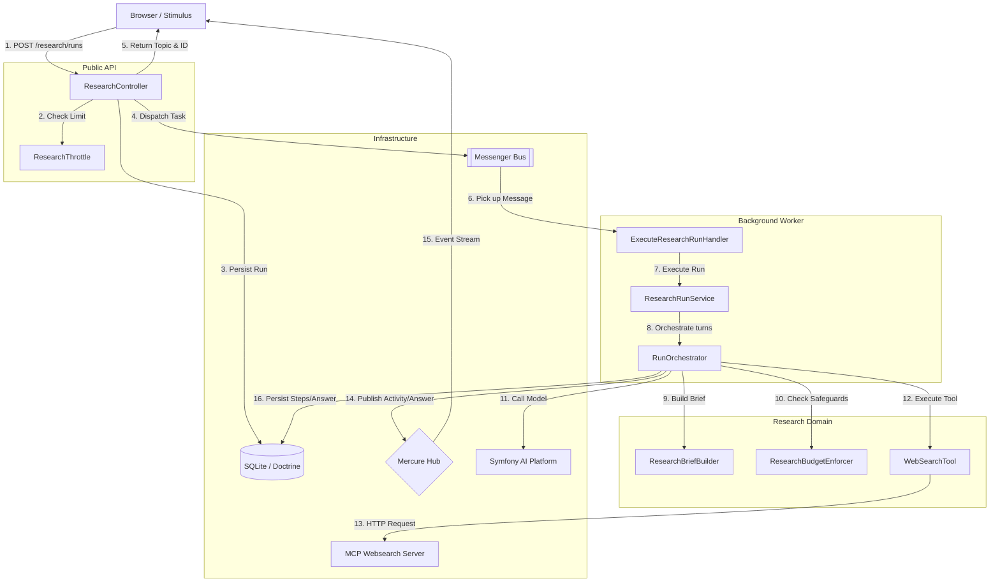

# Architecture

This document provides a technical overview of the **re-search** architecture, focusing on the web research workflow, request lifecycle, rate limiting, and safeguards.

## Research Workflow Overview

The web research feature is built around an asynchronous, background-execution model using Symfony Messenger and real-time event streaming via Mercure.

### Request Lifecycle

1.  **Submission**: The user sends a research query via the frontend. The `ResearchController::submit()` endpoint receives it.
2.  **Rate Limiting**: Before processing, the `ResearchThrottle` service validates the request against a `Symfony RateLimiter` using the user's `IP + Session ID`.
3.  **Persistence**: If accepted, a `ResearchRun` entity is created in SQLite with a `queued` status.
4.  **Asynchronicity**: The controller dispatches an `ExecuteResearchRun` message to the Symfony Messenger bus and immediately returns the `runId` and a private Mercure topic URL to the browser.
5.  **Background Execution**: A worker (or the same process in `sync` mode) picks up the message. `ExecuteResearchRunHandler` triggers the `ResearchRunService`.
6.  **Orchestration**: The `RunOrchestrator` manages the iterative loop:
    -   It builds a system brief using the `ResearchBriefBuilder`.
    -   It calls the AI platform (LlamaCpp via `flash` model).
    -   It detects tool calls (web search, page opening) and executes them via `WebSearchTool`.
    -   It enforces safeguards and budget limits at every turn.
7.  **Real-time Updates**: Throughout the execution, `MercureEventPublisher` sends `activity`, `answer`, `budget`, and `complete` events to the private Mercure topic.
8.  **Completion**: The final answer is persisted to the `ResearchRun` entity, and the run status is updated to `completed` (or `failed`/`budget_exhausted`/etc.).

## Rate Limiting & Safeguards

The system implements multiple layers of protection to ensure stability, cost control, and abuse prevention.

### Rate Limiting (Front Gate)

Managed by `App\Research\Throttle\ResearchThrottle`:
-   **Identifier**: `IP | Session ID`.
-   **Implementation**: Symfony RateLimiter.
-   **Behavior**: If the limit is exceeded, the request is stored as `throttled` in the database, and the user receives a `429 Too Many Requests` response with a `Retry-After` header.

### Runtime Safeguards (Research Loop)

Managed by `App\Research\Orchestration\RunOrchestrator` and `App\Research\Guardrail\ResearchBudgetEnforcer`:

| Limit | Value | Description |
| :--- | :--- | :--- |
| **Token Budget** | 75,000 | Cumulative total tokens (prompt + completion) allowed per run. |
| **Max Turns** | 75 | Maximum number of model/tool turn cycles allowed. |
| **Wall Clock Timeout**| 15 minutes | Maximum duration for a single background execution. |
| **Duplicate Calls** | 2 | A specific tool call (same signature) is allowed twice; the third triggers a loop-stop. |
| **Tool Failures** | 3 | Three consecutive tool execution failures will abort the run. |
| **Answer-Only Mode** | 2,000 tokens | When remaining budget is low, the orchestrator forces the model to stop tool usage and provide a final answer. |

### Budget Reminders

Every **5,000 tokens** used, the orchestrator injects a "Budget update" system message into the conversation to keep the model aware of its remaining resources and encourage it to focus on providing an answer.

## Component Responsibilities

-   **`ResearchRunService`**: High-level application service that loads entities and initiates orchestration.
-   **`RunOrchestrator`**: The core execution engine. Owns the model loop, turn-by-turn logic, and real-time event triggers.
-   **`ResearchBriefBuilder`**: Deterministically transforms the raw user query into a structured research plan (system prompt) including the current date and output requirements.
-   **`WebSearchTool`**: An adapter for the MCP (Model Context Protocol) web search server, exposing `search`, `open`, and `find` capabilities to the model.
-   **`ResearchBudgetEnforcer`**: Stateful enforcer that tracks token usage and tool call signatures to detect loops and budget exhaustion.
-   **`MercureEventPublisher`**: Handles the publication of domain-specific events (`activity`, `answer`, `budget`, `complete`) to Mercure.

## Data Model

-   **`ResearchRun`**: Stores the root request, client identity, overall status, total budget used, and final markdown answer.
-   **`ResearchStep`**: A detailed timeline of every turn, tool call, reasoning summary, and budget snapshot for history replay and auditing.
-   **`ResearchMessage`**: Optional detailed message history if ongoing chat continuity is enabled.

## Development and Debugging

-   **Logs**: Monitor background worker logs to see orchestration turns in real-time.
-   **Profiler**: Use the Symfony Profiler to inspect Messenger messages and database queries.
-   **SQLite**: The database is located at `data/research` (not committed to git).
-   **Mercure**: Ensure the Mercure hub is running (included in the Docker stack) for real-time UI updates.

## Extension Points

### Adding a New Tool
To add a new tool to the research agent:
1.  Create a service under `src/Research/Tool/`.
2.  Define it as a Symfony AI tool in `config/packages/ai.yaml` under `agent.web_research.tools`.
3.  Inject any necessary dependencies (e.g., HTTP clients or MCP adapters).
4.  Ensure the tool is registered in the orchestrator's toolbox.

### Adding a New Safeguard
To add a new runtime safeguard:
1.  Extend or implement `App\Research\Guardrail\ResearchBudgetEnforcerInterface`.
2.  Register the new safeguard in the `RunOrchestrator`.
3.  Throw a domain-specific exception (like `BudgetExhaustedException`) to trigger the corresponding loop-stop behavior.

### Modifying the Research Brief
To change how the agent is instructed or how queries are reformatted:
1.  Modify `App\Research\ResearchBriefBuilder`.
2.  Add logic to `build()` to inject new system messages or change the citation/formatting rules.
